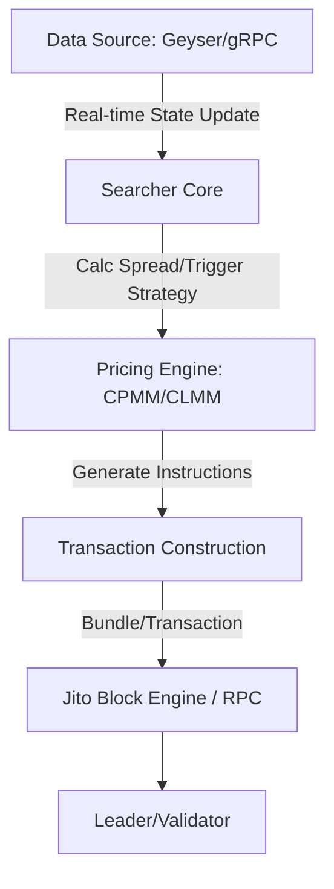

# Deep Dive into Solana MEV: "Dark Forest" Laws and Architectural Implementation Under High-Concurrency Engines

In the world of cryptocurrency, MEV (Maximal Extractable Value) is often likened to the "Dark Forest" of blockchain. With the explosion of the Solana ecosystem, this forest has become increasingly deep and complex. Compared to Ethereum's mature PBS (Proposer-Builder Separation) model, Solana, with its unique parallel execution, extremely high throughput, and slot time of less than 400ms, provides a completely different set of game rules for MEV explorers (Searchers).

As the opening piece of the **Solana MEV Deep Exploration Series**, this article will break down the underlying logic of Solana MEV from four dimensions: core concepts, transaction pipeline, technical architecture, and engineering implementation.

---

## 1. Redefining MEV: Gaming in the Context of Solana

### 1.1 What is MEV?
MEV refers to the additional value that block producers (called Leaders in Solana) can obtain by **including, excluding, or reordering** transactions within the blocks they produce.

In Solana's high-performance environment, MEV is not just about "front-running", it embodies more of an **extreme latency competition and capital efficiency game**:

*   **Front-running:** Executing before a target transaction.
*   **Sandwich Attack:** Inserting buy and sell orders before and after a transaction with loose slippage control.
*   **Back-running:** Following up immediately with arbitrage execution after a large trade causes price impact.
*   **Spatial Arbitrage:** Capturing price differences between different liquidity pools like Raydium, Orca, Meteora, etc.
*   **Liquidation:** Snatching liquidation rewards the moment a lending protocol triggers liquidation due to price fluctuations.

### 1.2 "Significant Differences" Between Solana and Ethereum
Solana's mechanism determines that it does not have the "classic public Mempool" of Ethereum.

1.  **No Global Public Mempool:** Transactions are sent directly to the Leader via QUIC protocol. It is difficult for ordinary users to execute sandwich attacks precisely by observing the Mempool as on Ethereum.
2.  **Deterministic Scheduling:** Solana uses the parallel processing engine Sealevel. If two transactions involve non-overlapping accounts, they will be executed in parallel, weakening the significance of ordering in a parallel environment.
3.  **Extremely Low Latency:** The 400ms block time requires Searcher's strategy logic to be completed within milliseconds: Sense State -> Calculate Spread -> Construct Transaction -> Send.

---

## 2. Overview of Solana Transaction Pipeline: Insertion Points for MEV

To capture MEV, one must understand how a transaction "flows" in the Solana network:

1.  **Transaction Construction:** The client specifies Instructions, account mappings, and signatures.
2.  **TPU Reception:** The transaction reaches the current Leader (TPU unit) via QUIC protocol.
3.  **Pipeline Ordering:** The Leader orders transactions within its Slot. At this point, **Priority Fee** and **Jito Tip** are key to determining the order.
4.  **Banking Stage:** Execute transactions, modify account states.
5.  **Final Confirmation:** Go through three confirmation stages (Processed -> Confirmed -> Finalized).

**Key Points for MEV Capture:**
*   **Perception Speed:** The faster you get Account Updates, the earlier you can discover opportunities.
*   **Inclusion Determinism:** How to ensure your arbitrage transaction is not discarded? This gave birth to third-party Bundle mechanisms like Jito.

---

## 3. Technical Framework: Core Components of a Searcher

In engineering implementation, a mature Solana MEV system usually includes the following modules:



*   **State Feed (State Perception):** Deprecating traditional WebSocket `logsSubscribe`, high-performance systems typically connect to **Geyser Plugins** or gRPC streams to obtain microsecond-level account change pushes.
*   **Searcher (Strategy Brain):** Responsible for parsing data streams, identifying pool changes, and executing risk control models.
*   **Block Engine (Inclusion Mechanism):** Similar to Flashbots on Ethereum. On Solana, **Jito-Solana** is mainstream, allowing Searchers to pack multiple transactions into a **Bundle** and pay Tips to Validators, ensuring atomic execution (all succeed or all fail).

---

## 4. Engineering Implementation: Layered Architecture Design

To balance development efficiency and execution performance, mainstream architectures tend to adopt a **"Control Plane + Data Plane"** layered design.

### 4.1 Layered Logic
*   **Control Plane:** Usually written in **Python** or Go. Responsible for high-level logic, strategy scheduling, configuration file management, API interaction, and monitoring dashboards.
*   **Data Plane:** Must use **Rust**. Responsible for extremely fast data parsing (such as parsing complex Raydium/Orca states), local pricing calculation, signature construction, and Jito-based transaction sending.

### 4.2 Core Algorithm: Inventory-Driven Monitoring
Blindly listening to all pools on the network leads to severe network congestion and computational waste. Efficient systems will:
1.  **Cold Start Scan:** Fetch all liquidity pools from Raydium and Orca APIs, filtering out potential arbitrage pairs based on asset quality and TVL.
2.  **Whitelist Generation:** Only subscribe to the screened pool accounts.
3.  **Local State Mirror:** Maintain a lightweight mirror of these pools (Reserves, SqrtPrice, etc.) in memory, without frequent RPC requests.

---

## 5. Core Code Logic Demonstration (Pseudocode)

### 5.1 Cross-Protocol Pricing Difference Calculation
Pricing logic varies by protocol. For example, Raydium's CPMM vs. Orca's CLMM:

```python
# Constant Product Market Maker (CPMM) Simulation Output Calculation
def calculate_cpmm_out(amount_in, res_in, res_out, fee_rate=0.0025):
    amount_with_fee = amount_in * (1 - fee_rate)
    return (amount_with_fee * res_out) / (res_in + amount_with_fee)

# Concentrated Liquidity (CLMM) Price Parsing (Q64.64 Format)
def sqrt_price_x64_to_price(sqrt_price_x64):
    price = (sqrt_price_x64 / (2**64)) ** 2
    return price
```

### 5.2 Monitoring and Trigger Logic
In the Rust Data Plane, the system listens for specific account changes:

```rust
// Pseudocode: Core processing flow after hearing account update
match account_update {
    RaydiumUpdate(data) => {
        let new_price = parse_raydium_reserves(data);
        inventory.update_price("SOL/USDC", Protocol::Raydium, new_price);
        check_arbitrage_opportunity("SOL/USDC");
    },
    OrcaUpdate(data) => {
        let new_price = parse_orca_sqrt_price(data);
        inventory.update_price("SOL/USDC", Protocol::Orca, new_price);
        check_arbitrage_opportunity("SOL/USDC");
    }
}
```

---

## 6. Summary: Future High Ground of Competition

Solana MEV has evolved from early "simple scripting" to an "all-around engineering race":
1.  **Network Optimization:** Whose server is closer to the Leader, whose QUIC connection configuration is better.
2.  **Algorithm Precision:** Instantaneous pricing precision for complex CLMM (Concentrated Liquidity) pools.
3.  **Capital Efficiency:** Ability to find the optimal path among multiple paths and combine Jito Bundles to avoid fee losses caused by failed transactions.

In the upcoming series of articles, we will delve into **How to Build a Network-Wide Token Index (Inventory)**, **How to Optimize gRPC Data Parsing Speed**, and **Jito Bundle Atomic Combat**.

Welcome to the Dark Forest of Solana, may your Bundles always be included.

---

*This article is a technical sharing series for Levi.eth, stay tuned for more Solana engineering combat dry goods.*
