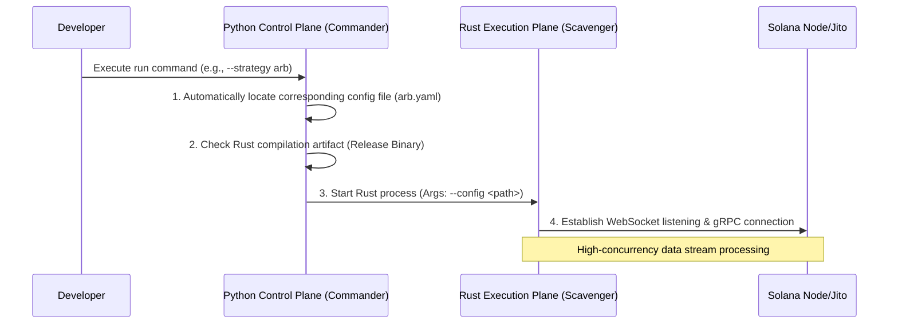

# The "Brain" of the Strategy Engine: Architectural Practice of Decoupling Control Plane and Execution Plane

When building a Solana MEV system, developers often face a classic trade-off: **Rust's Speed** vs. **Python's Flexibility**.

To be able to burst like a cheetah (execution performance) while switching strategies flexibly like a fox (scheduling flexibility) in the "Dark Forest", we adopted a **Two-Tier Architecture Design**: a **Control Plane** built with Python responsible for strategy orchestration and configuration management, and a **Data Plane (Execution Plane)** built with Rust responsible for high-concurrency data processing.

This article will break down the logic behind this architecture and how to implement an industrial-grade strategy scheduling engine using Python.

---

## 1. Why Do We Need a "Control Plane"?

If we compare an MEV bot to a race car, the Rust execution engine is the V12 engine capable of withstanding high RPMs, while the Python control plane is the dashboard and gear stick in the cockpit.

### 1.1 Decoupling Configuration and Logic

MEV strategies (such as arbitrage, sniping, liquidation) involve a large number of parameters: RPC node addresses, Jito Tip limits, whitelist tokens, maximum slippage controls, etc.

*   **Pain Point:** If these configurations are hardcoded in Rust, every fine-tuning of parameters requires recompilation. In a rapidly changing market, tens of seconds of compilation time are enough to let opportunities slip away.
*   **Solution:** Python is responsible for reading YAML/JSON configurations, preprocessing logic, and injecting them into the Rust process as command-line arguments or environment variables.

### 1.2 Unified Entry and Multi-Strategy Management

A mature system often runs multiple strategies simultaneously.

*   **Arb (Arbitrage):** Long-running, monitoring mainstream pools.
*   **Sniper:** Started temporarily, targeting newly issued tokens.
*   **Control Plane:** Acts as a unified scheduler (Commander) that can launch different strategy instances with one click based on market conditions, realizing "Strategy as a Plugin".

---

## 2. Architecture Overview: Cross-Language Boundaries and Interfaces

The core interaction of the system follows the principle of **"Unidirectional Derivation, Process Isolation"**:



*   **Control Plane Responsibilities:** Environment check, automatic path derivation, process lifecycle management, Graceful Shutdown.
*   **Execution Plane Responsibilities:** Account state parsing, local pricing calculation, transaction construction, Bundle submission.

---

## 3. Technical Implementation Details

### 3.1 Path Adaptation and Compilation Fallback

In a production environment, we run pre-compiled Rust Release binaries directly for the fastest startup speed. However, during the development and debugging phase, we want it to detect automatically.

**Scheduling Logic Pseudocode:**
1.  Check if binary exists under `target/release/`.
2.  If it exists, run directly via `subprocess.spawn`.
3.  If not, fallback to `cargo run --release`.

### 3.2 Environment Isolation and Working Directory Constraints

MEV bots usually need to read local wallets (Keypairs) and cache files. To ensure security and consistency, the control plane must strictly constrain the **Current Working Directory (CWD)** of the Rust process. This effectively prevents path drift in different environments (Docker vs. Physical Machine).

---

## 4. Industrial-Grade Scheduler Code Example

Below is a simplified Python control plane implementation example. It demonstrates how to manage subprocesses and dynamically inject configurations.

```python
import argparse
import os
import subprocess
import sys
from pathlib import Path

class BotCommander:
    def __init__(self, strategy: str, config_name: str):
        self.strategy = strategy
        self.config_path = Path(f"configs/{config_name}.yaml").absolute()
        self.root_dir = Path(__file__).parent.parent  # Project root directory
        self.engine_dir = self.root_dir / "engine_rust" # Rust source directory

    def _find_binary(self) -> list:
        """Select execution command: prioritize release binary, otherwise fallback to cargo run"""
        release_bin = self.engine_dir / "target" / "release" / "mev_engine"
        
        if release_bin.exists():
            print(f"[*] Using pre-compiled binary: {release_bin}")
            return [str(release_bin)]
        
        print("[!] Release binary not found, attempting to start via cargo run...")
        return ["cargo", "run", "--release", "--bin", "mev_engine", "--"]

    def run(self):
        # Assemble full execution command
        base_cmd = self._find_binary()
        args = [
            "--strategy", self.strategy,
            "--config", str(self.config_path)
        ]
        full_cmd = base_cmd + args

        print(f"[*] Starting strategy [{self.strategy}]...")
        try:
            # Start execution plane using subprocess and lock working directory
            subprocess.run(full_cmd, cwd=self.engine_dir, check=True)
        except KeyboardInterrupt:
            print("\n[!] Stop signal received, shutting down bot...")
        except subprocess.CalledProcessError as e:
            print(f"[X] Execution engine crashed, exit code: {e.returncode}")

if __name__ == "__main__":
    parser = argparse.ArgumentParser(description="Solana MEV Control Plane")
    parser.add_argument("--strategy", default="arbitrage", help="Select strategy to run")
    parser.add_argument("--config", default="mainnet_alpha", help="Config file name")
    
    cmd_args = parser.parse_args()
    commander = BotCommander(cmd_args.strategy, cmd_args.config)
    commander.run()
```

---

## 5. Performance Optimization and DevOps Thoughts

In actual production, the design of the control plane also needs to consider the following points:

1.  **Warm-up:** Before officially starting arbitrage monitoring, the control plane can run a simple Python script to check RPC node latency and wallet balance, ensuring "nothing goes wrong" before passing the baton to Rust.
2.  **Log Triage:** The Rust side outputs structured JSON logs, and the Python side is responsible for collecting and pushing them to remote monitoring (such as Loki or Telegram Bot).
3.  **Hot Update Strategy:** For "blacklist tokens" that do not require code logic modification, file watcher mechanisms can be used. When Python modifies the configuration file, the Rust side reloads in real-time via the `notify` library without restarting the process.

## 6. What's Next

With the control plane as a guarantee, we can safely enter the world of Rust. In the next article, we will dissect **"Inventory-Driven Monitoring"**—how to build an efficient index of network-wide tokens and liquidity pools using Rust, and instantly lock onto winning opportunities in massive transaction streams.

---
*Written by Levi.eth. In the world of Solana MEV, a small step in architectural optimization is often a giant leap in profit.*
