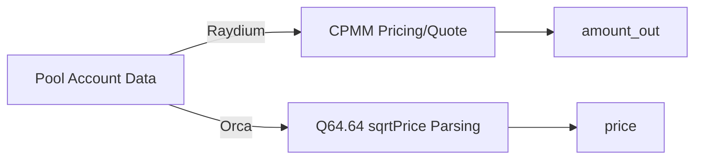

# AMM: Pricing and Mathematical Models

This project aims to perform "pricing" locally as much as possible: even with only the raw data of pool accounts, it can quickly calculate prices/quotes locally, reducing reliance on RPC simulations and lowering latency.

## 1. Module Functionality Overview

- **CPMM (Raydium):** Constant Product pricing and quote calculation (`x*y=k`).
- **CLMM (Orca Whirlpool):** Deriving price from `sqrt_price(Q64.64)` and supporting tick/liquidity field reading (currently only for price reading; full swap requires tick arrays).
- **Quote:** Calculating `amount_out` locally by fetching necessary account data (AMM state + vault balance) via RPC.

Corresponding Source Code:

- CPMM: `../../scavenger/src/amm/math.rs`
- Raydium AMM State: `../../scavenger/src/amm/raydium_v4.rs`
- Orca Whirlpool Price Parsing: `../../scavenger/src/amm/orca_whirlpool.rs`
- Raydium Quote: `../../scavenger/src/core/quote.rs`



## 2. Technical Implementation Details

### 2.1 Raydium (CPMM) Core

Common integer formulas for CPMM (including fees):

- `amount_in_with_fee = amount_in * (fee_den - fee_num)`
- `amount_out = (amount_in_with_fee * reserve_out) / (reserve_in * fee_den + amount_in_with_fee)`

This project uses `U256` to avoid u128 overflow, see `amm/math.rs`.

### 2.2 Orca Whirlpool (CLMM) Core

Orca Whirlpool's `sqrt_price` is represented in Q64.64 (fixed-point number):

- `price = (sqrt_price / 2^64)^2`

To avoid defining the full Whirlpool account structure (which involves large fields and reward infos), this project uses an "offset slicing" approach to read key fields from account data:

- liquidity: `data[49..65]`
- sqrt_price: `data[65..81]`
- tick: `data[81..85]`

See `decode_current_price` in `amm/orca_whirlpool.rs`.

## 3. Key Algorithms and Data Structures

- **High-Precision Integers:** `U256` (generated by Rust `uint` macro)
- **Local Quoting:** `core/quote.rs` calls `amm/math.rs` after fetching vault balances.

## 4. Performance Optimization Points

- **Local Pricing First:** Calculate prices directly using account data to avoid heavy RPC calls like `simulateTransaction`.
- **Caching and Batch Reading (Future Improvements):**
  - Short TTL caching for frequently used vault balances.
  - Batch RPC (`getMultipleAccounts`) for multiple quotes within the same slot.

## 5. Runnable Example (CPMM Quote + Q64.64 Price Conversion)

```python
def get_amount_out(amount_in: int, reserve_in: int, reserve_out: int, fee_num: int, fee_den: int) -> int:
    # CPMM (with fee) integer implementation: suitable for quick quotes/estimations
    amount_in_with_fee = amount_in * (fee_den - fee_num)
    numerator = amount_in_with_fee * reserve_out
    denominator = reserve_in * fee_den + amount_in_with_fee
    return numerator // denominator

def sqrt_price_x64_to_price(sqrt_price_x64: int) -> float:
    # Orca Whirlpool: price = (sqrt_price / 2^64)^2
    q64 = float(1 << 64)
    p = float(sqrt_price_x64) / q64
    return p * p

def demo():
    out = get_amount_out(amount_in=100, reserve_in=1000, reserve_out=1000, fee_num=25, fee_den=10000)
    print("cpmm amount_out:", out)
    print("price(sqrt=2^64):", sqrt_price_x64_to_price(1 << 64))

if __name__ == "__main__":
    demo()
```

## 6. Related Articles

- **Upstream (Data generated by monitoring):** [Scout_Transaction_Monitoring_and_Parsing.md](./Scout_Transaction_Monitoring_and_Parsing.md)
- **Downstream (How arbitrage strategy uses prices):** [StrategyArb_Cross_DEX_Arbitrage_Strategy.md](./StrategyArb_Cross_DEX_Arbitrage_Strategy.md)
