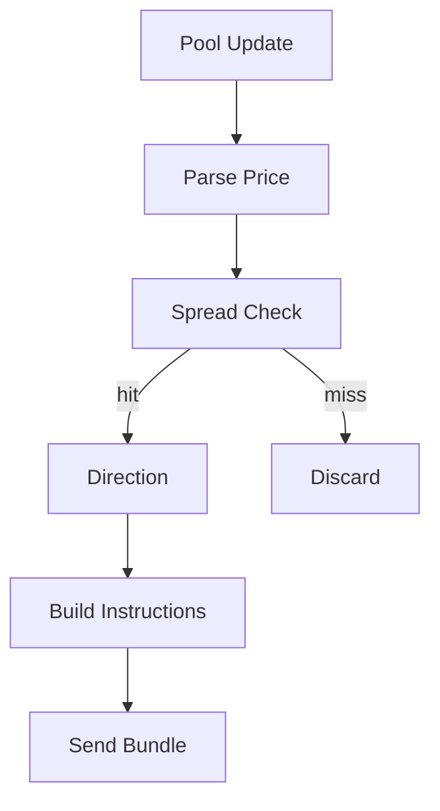

# Strategy: Cross-DEX Arbitrage Strategy (arb)

The arb strategy is embodied in this project as a closed loop of "Discover Spread → Decide Direction → Construct Atomic Transaction → Send Bundle". The current implementation uses "Price Difference between Raydium vs Orca" as the trigger condition, and constructs a Raydium swap + tip bundle when an opportunity is found (Orca swap construction currently lacks tick array dependency, which is a to-do item).

## 1. Module Functionality Overview

- Receive pool account updates (Raydium or Orca).
- Parse Price:
  - Orca: Calculate price directly from `sqrt_price`.
  - Raydium: Read cached fields from AMM state and calculate price (or read vault balance via quote module for more realistic quoting).
- Calculate Spread: Trigger when spread exceeds threshold.
- Generate Transaction Instructions: Construct swap instruction, append tip instruction.
- Send Execution: Serialize transaction to base58, call Jito bundle interface to send.



Corresponding Source Code:

- `../../scavenger/src/strategies/arb.rs`

## 2. Technical Implementation Details

### 2.1 Trigger and Direction

- Spread Calculation: `spread = abs(price_a - price_b) / min(price_a, price_b)`
- Direction Selection: Buy Low Sell High (If A < B, buy A sell B, otherwise vice versa)

### 2.2 Instruction Construction and Limitations

Current Implementation:

- Raydium swap: Constructible (see `build_raydium_swap_ix` in `arb.rs`)
- Orca swap: Logic is clear but lacks account completion like tick array/oracle, temporarily returns directly (see warning in `arb.rs`)

Therefore, at this stage, the "real executable arbitrage closed loop" still needs to complete the account derivation and tick array selection logic for Orca swap.

## 3. Key Algorithms and Data Structures

- Spread determination and direction selection
- Atomic Transaction Instruction List: `Vec<Instruction>` (Swap first, then Tip)
- Transaction serialization and bundle payload (see execution module)

## 4. Performance Optimization Points

Key bottlenecks in arbitrage strategy performance are usually not in mathematical calculations, but in:

- Quoting Acquisition (RPC/Account Reading): Cache as much as possible or use accountSubscribe to get data directly.
- Account Derivation Required for Instruction Construction: Pre-calculation and caching (e.g., ATA, PDA, tick arrays).
- Transaction Inclusion Probability: Dynamic adjustment of tip/priority fee (refer to profit/tip model in `core/pricing.rs`).

## 5. Runnable Example (Spread Determination + Direction Selection + Tip Calculation)

The following example demonstrates a "runnable minimal arbitrage decider": inputs prices on both sides and configuration, outputs direction and tip (does not depend on Solana SDK).

```python
from dataclasses import dataclass
from typing import Optional, Tuple

@dataclass(frozen=True)
class ProfitConfig:
    min_profit_sol: float = 0.01
    max_tip_sol: float = 0.1
    gas_cost_sol: float = 0.000005
    dynamic_tip_ratio: float = 0.5

def decide_arbitrage(
    price_a: float,
    price_b: float,
    input_sol: float,
    cfg: ProfitConfig,
) -> Optional[Tuple[str, float]]:
    # Input: Prices on both sides and invested capital; Output: Direction and tip (if net profit threshold is met)
    if price_a <= 0 or price_b <= 0:
        return None

    buy_on = "A" if price_a < price_b else "B"
    sell_on = "B" if buy_on == "A" else "A"

    gross_profit = input_sol * (abs(price_a - price_b) / min(price_a, price_b))
    potential_tip = gross_profit * cfg.dynamic_tip_ratio
    tip = min(potential_tip, cfg.max_tip_sol)
    net_profit = gross_profit - cfg.gas_cost_sol - tip

    if net_profit >= cfg.min_profit_sol:
        return (f"buy {buy_on} -> sell {sell_on}", tip)
    return None

if __name__ == "__main__":
    cfg = ProfitConfig()
    decision = decide_arbitrage(price_a=1.00, price_b=1.02, input_sol=1.0, cfg=cfg)
    print("decision:", decision)
```

## 6. Related Articles

- **Upstream (Pricing Source):** [AMM_Pricing_and_Mathematical_Model.md](./AMM_Pricing_and_Mathematical_Model.md)
- **Downstream (Transaction Construction and Bundle Sending):** [Execution_Atomic_Transaction_and_JitoBundle.md](./Execution_Atomic_Transaction_and_JitoBundle.md)
- **Risk Control (New Coin/Permission Check):** [Risk_Risk_Control_and_Safety_Checks.md](./Risk_Risk_Control_and_Safety_Checks.md)
