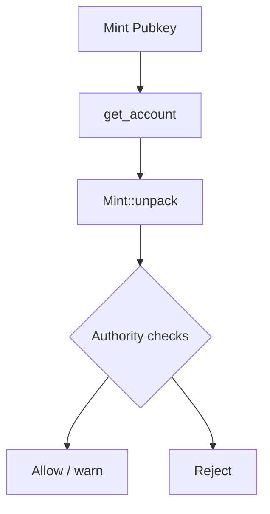

# Risk: Risk Control and Safety Checks

MEV strategy risks come not only from "price fluctuations" but also from "asset permissions and tradability". For example, if a new token has a Freeze Authority, it may cause assets to be unable to be transferred out, turning arbitrage/sniping directly into a capital black hole.

## 1. Module Functionality Overview

- **Security Checks on Target Token Mint:**
  - Whether Freeze Authority is None
  - Whether Mint Authority has been discarded (strict strategy may require it to be None)
  - Read supply/decimals as risk references



Corresponding Source Code:

- `../../scavenger/src/core/risk.rs`

## 2. Technical Implementation Details

Execution steps of `check_token_risk`:

1. RPC fetch mint account: `get_account(mint)`
2. Parse data using SPL Token's `Mint::unpack`
3. Judge risk based on authority fields and output `RiskReport`

Common extended checks in strategies include:

- Whether transfer is possible (transfer hook, blacklist mechanisms, etc.)
- Whether LP is locked, whether liquidity can be removed
- Whether the contract is upgradable (upgrade authority)
- Transaction tax/Anti-MEV mechanisms (some tokens deduct tax during transfer/swap)

## 3. Key Algorithms and Data Structures

- `RiskReport`: Unifies check results, facilitating the strategy layer to make "hard rejection/soft warning" decisions.

## 4. Performance Optimization Points

- **Caching:** Cache risk reports for the same mint (TTL e.g., 10~60 minutes) to avoid high-frequency repetitive RPC calls.
- **Batching:** Use `getMultipleAccounts` to batch fetch a group of mints.

## 5. Runnable Example (Minimal Risk Checker)

This example simulates mint permission check logic using pure Python data structures and can be run directly:

```python
from dataclasses import dataclass
from typing import List, Optional

@dataclass(frozen=True)
class MintMeta:
    mint_authority: Optional[str]
    freeze_authority: Optional[str]
    supply: int
    decimals: int

@dataclass(frozen=True)
class RiskReport:
    is_safe: bool
    reasons: List[str]

def check_mint_risk(m: MintMeta, strict: bool = False) -> RiskReport:
    # When strict=True, mint_authority is also treated as a hard risk
    reasons: List[str] = []
    safe = True
    if m.freeze_authority is not None:
        safe = False
        reasons.append("freeze_authority is set")
    if strict and m.mint_authority is not None:
        safe = False
        reasons.append("mint_authority is set (strict)")
    if m.decimals > 12:
        reasons.append("unusual decimals")
    return RiskReport(is_safe=safe, reasons=reasons)

if __name__ == "__main__":
    demo = MintMeta(mint_authority="AUTH", freeze_authority=None, supply=10_000_000, decimals=6)
    print(check_mint_risk(demo, strict=False))
    print(check_mint_risk(demo, strict=True))
```

## 6. Related Articles

- **Upstream (Gating before strategy execution):** [StrategyArb_Cross_DEX_Arbitrage_Strategy.md](./StrategyArb_Cross_DEX_Arbitrage_Strategy.md)
